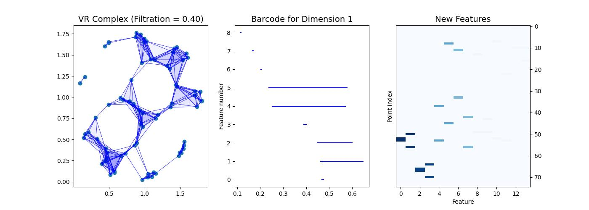

# TDA-for-Travelling-Salesman
This repository implements a novel approach to solving the Traveling Salesman Problem. Based on the transformer-based model introduced in [1](#references) (earlier such a transformer was created by [2](#references)), our algorithm first computes topological features of the given set of points on the 2D plane using the power of topological data analysis: 
1. Compute homology.
2. Extract 1-dimensional barcode.
3. For each barcode segment, find the edge that creates it and the edge that kills it.
4. Map the lifetime of the segment to the points that form the edges from the previous step.

Example of feature matrix        |
:-------------------------:|
    |

To measure the quality of the algorithm's solutions, we first find optimal solutions with the Concorde solver. Then we measure the relative difference between the average tour length of the model and that of Concorde on a fixed test set consisting of a thousand TSP instances, specifically

$$\text{Optimality Gap} = \frac{L_{model} - L_{opt}}{L_{opt}},$$

where $L_{model}$ - average length of paths predicted by the proposed model and $L_{opt}$ - average length of optimal paths obtained by the Concorde algorithm.

Our solution showed signifcant imporvement of optimality gap compared to the baseline solution for TSP task on 20 nodes.

TSP task on 10 nodes       |  TSP task on 20 nodes
:-------------------------:|:-------------------------:
   |  

Predicted path examples         |
:-------------------------:|
    |

# Repository structure

[`train_tsp_pipeline.ipynb`](train_tsp_pipeline.ipynb) contains the main pipeline of the work: topological feature extraction, training, and visualization. This file can be run in Google Colaboratory. 

[`checkpoint`](checkpoint) contains checkpoints with model parameters, metrics, statistics about the training process.

[`TDA`](TDA) contains notebooks with experiments performed during the research and development of topological features.

[`data`](data) contains test examples of TSP instances for 10 and 20 nodes. Basically, these are pickle files with a pre-generated random set of points.

[`pyconcorde`](pyconcorde) is used to build the Concorde TSP solver with pip.

[`tsp_transformer`](tsp_transformer) contains baseline transformers extracted from [github](https://github.com/xbresson/TSP_Transformer) by authors [1](#references).

# Contributors
- [Elfat Sabitov](https://github.com/MarioAuditore) (HSE, Skoltech): training, basilene development, reserch assistance in TDA.
- [Alex Fokin](https://github.com/Alex2034) (MIPT, Skoltech): TDA research, training, visualization. 
- [Ivan Gusev](https://github.com/LilVan) (MIPT, Skoltech): topological features development, massive research contribution.

# References
1. [The Transformer Network for the Traveling Salesman Problem](https://arxiv.org/abs/2103.03012)
2. [Attention, Learn to Solve Routing Problems!](https://arxiv.org/abs/1803.08475)
