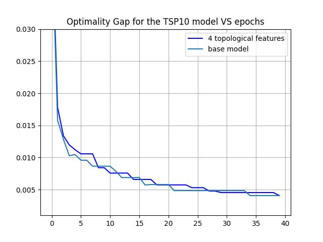
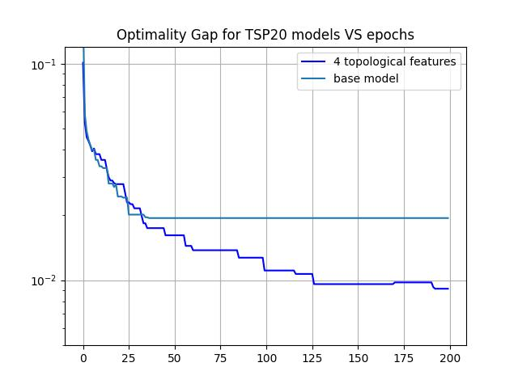
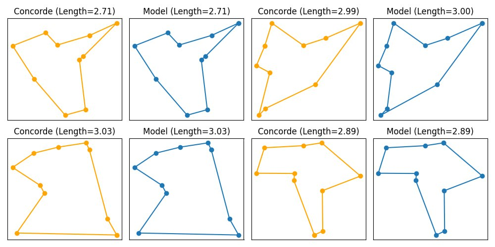

# TDA-for-Travelling-Salesman
This repository implements a novel approach in solving Traveling Salesman Problem. Based on Tranformer model introduced in [1] (earlier such transformer was created by [2]), our algorithm first computes topological features of provided set of points on 2d plain with the power of Topological Data Analysis: 
1. Compute homologies.
2. Extract 1-dimensional homologies.
3. For each homology find an edge that creates it and the one kill that kills it.
4. Map the lifetime of the homologies to the points, which form the edges from previous step.

To measure the quality of algorithm's solutions we find optimal solutions with concorde solver first. Then we measure the optimal gap between model's average tour length and concorde's one on fixed test set, consisting of thousand of TSP instances:

$$gap = \frac{L_{model}}{L_{concorde}} - 1,$$

where $L_{model}$ - average length of solutions, which the proposed model gives and $L_{concorde}$ - average length of solutions, which concorde algorithm gives.

Our solution showed signifcant imporvement of optimality gap compared to the baseline solution for TSP task on 20 nodes.

TSP task on 10 nodes       |  TSP task on 20 nodes
:-------------------------:|:-------------------------:
  |  

Example:

# Contributors
- Elfat Sabitov (HSE, Skoltech): training, basile support, reserch assistance.
- Alex Fokin (MIPT, Skoltech): TDA research, training, visualization. 
- Ivan Gusev (MIPT, Skoltech): topological features development, massive research contribution.

# References
[1] [The Transformer Network for the Traveling Salesman Problem](https://arxiv.org/abs/2103.03012)
[2] [Attention, Learn to Solve Routing Problems!](https://arxiv.org/abs/1803.08475)
